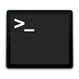

# CHEATSHEET

## VIM

* [VIM CHEAT SHEET](./vim.md)
* [plug surround](./plug_surround.md)
* [plug commentary](./plug_commentary.md)

## TERMINAL

* [TERMINAL CHEAT SHEET](./terminal.md)
* [DocFzf](./docFzf.md)

## GIT

* [GIT CHEAT SHEET](./git.md)

## THANKS TO
* [rolemodelu](http://rolemodelu.com) (cheatsheet logo)
* [LO4D.com](lo4d.com) (vim logo)
* [medium.freecodecamp.org](medium.freecodecamp.org/) (terminal logo)
* [icons8.com](icons8.com) (git logo)

## LICENSE
MIT
